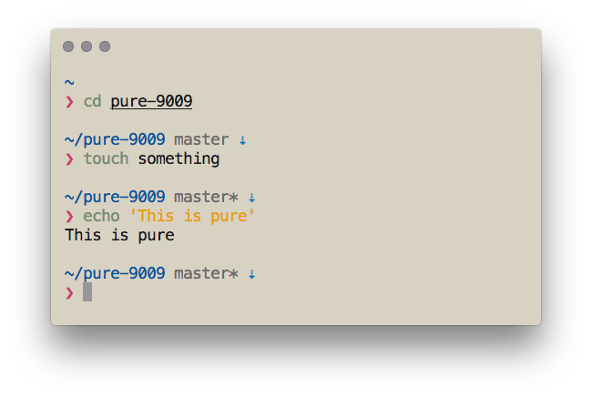

# Pure-9009

> A modified ZSH prompt based on Pure

## In Brief

### This is Pure


### This is Pure-9009


## Install

### [antigen](https://github.com/zsh-users/antigen)

Update your `.zshrc` file with the following two lines (order matters). Do not use the `antigen theme` function.

```sh
antigen bundle richohan/pure-9009
```

### Others

Please refer to the documentation in [Pure](https://github.com/sindresorhus/pure).

## Hyper Themes
To make your terminal 100% aligned with the screenshot, consider using [hyper-9009](https://github.com/RichoHan/hyper-9009).

## License
MIT

> Copyright for portions of project [Pure-9009](https://github.com/RichoHan/pure-9009) are held by [[Sindre Sorhus](sindresorhus.com)] as part of project [Pure](https://github.com/sindresorhus/pure). All other copyright for the rest of the project are held by [[Richo Han](http://richo.tw), 2018].